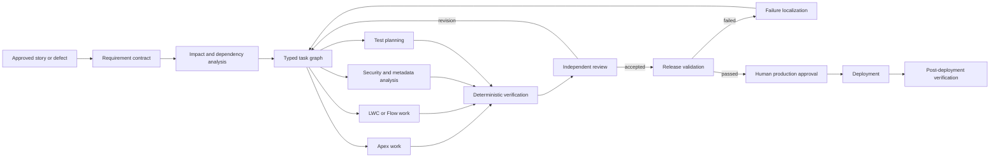

# Salesforce Change Delivery Graph Profile

Read this reference only when the graph governs Salesforce analysis, implementation, validation, promotion, or deployment. Adapt it to the team's actual branching model, org topology, CI, and release tooling. Do not assume scratch orgs, Gearset, GitHub, or a particular agent runtime exists without verifying them.

## Recommended topology

Use parallel branches only when their file, metadata, and org-state interactions are isolated or have an explicit integration owner. One builder is safer for a small cross-layer change than artificial Apex, Flow, and LWC fragmentation.

## Inputs and reusable artifacts

Normalize the request into a versioned contract containing:

- goal and affected behavior;
- acceptance criteria and edge cases;
- nonfunctional and security requirements;
- affected users and permission expectations;
- data migration or backfill needs;
- production risk and approval owner;
- unresolved product or architecture decisions.

If available, consume existing ticket specifications, impact maps, access audits, test plans, and repository rules rather than rediscovering them. In this skill set, `ticket-to-spec`, `change-impact-mapper`, `permission-fls-auditor`, `test-coverage-gap-finder`, `acceptance-criteria-auditor`, and `sf-code-reviewer` can produce or evaluate graph artifacts. Their presence does not authorize running them or modifying an org outside the user's request.

## Dependency and context graph

Connect the requested behavior to relevant:

- objects, fields, record types, and validation rules;
- Apex classes, triggers, schedulers, batches, and tests;
- Flows, subflows, LWCs, Aura, and Experience Cloud components;
- permission sets, custom permissions, sharing, and FLS;
- custom metadata, named credentials, integrations, and managed packages;
- requirements, incidents, decisions, commits, reviews, validation jobs, and releases.

Use Salesforce dependency metadata and repository search as inputs, not proof of complete coverage. Dynamic SOQL, string-based metadata references, external consumers, private reports, and undocumented operations are blind spots that must remain explicit.

Assemble the smallest context package each role needs. A builder usually needs the requirement slice, affected source neighborhood, architecture rules, relevant tests, and assigned task contract—not the entire repository history.

## Role and authority profile

| Role | Typical source access | Org access | Authority |
| --- | --- | --- | --- |
| Requirement / impact analyst | Read | Metadata or non-prod read | Analyze only |
| Builder | Assigned workspace or worktree | Approved isolated non-prod target | Implement only |
| Verifier | Read, plus test artifacts if assigned | Approved non-prod test target | Execute checks |
| Independent reviewer | Read | Read/test only | Review, not self-approve |
| Release validator | Read | Validation environments | Validate, not approve production |
| Human release owner | Approval record | Established release process | Authorize production transition |

Verify the exact branch, workspace, org alias, and target environment before mutation. Preserve unrelated work. Use dedicated worktrees and scratch orgs when they fit the team's workflow; otherwise document the equivalent isolation boundary.

## Deterministic evidence gates

Select checks based on the changed components and acceptance criteria. Typical gates include:

1. metadata or source compilation;
2. applicable Apex tests, including bulk and negative paths;
3. LWC unit tests where applicable;
4. static analysis and security checks;
5. metadata validation against the intended target org;
6. changed-file and package-boundary checks;
7. test-to-component and requirement-to-evidence traceability;
8. release-tool or CI validation;
9. post-deployment smoke or UAT evidence where required.

Do not equate deployment success with behavior acceptance, and do not substitute an LLM review for test or validation output. Record "not applicable" with a reason; do not silently omit expected gates.

## Failure routing

Map evidence back to the owning task:

- compilation or unit-test failure -> component builder;
- permission or security finding -> access/security owner and affected builder;
- integration validation failure -> integration owner plus the producing component;
- acceptance-criteria gap -> requirement contract or implementation owner, depending on cause;
- release validation drift -> packaging, environment, or dependency owner;
- post-deployment regression -> incident and rollback/forward-fix decision graph.

A failure should invalidate all descendants that consumed the changed artifact, but not independent successful analysis or implementation branches.

## Production gate

Bind human approval to:

- requirement and graph version;
- source commit and release package;
- required test and analyzer evidence;
- target environment and deployment plan;
- known risks, manual steps, and rollback or forward-fix criteria.

Any material artifact change after approval requires revalidation or reapproval according to an explicit policy. The agent may prepare evidence and summarize risk; it does not infer authority to deploy to production.

## Small pilot

Choose a medium-risk change with at least two meaningful component or analysis branches and one real approval gate. Keep routing fixed initially. The pilot should prove:

- typed contracts and artifact exchange;
- isolated execution;
- at least one safe parallel branch and fan-in;
- deterministic failure localization and selective rerun;
- checkpoint and resume;
- complete requirement-to-release provenance;
- a persisted human approval transition.

Measure lead time, critical-path time, wait versus execution time, retry count, first-pass validation, human intervention, failure-localization accuracy, and provenance completeness. Add dynamic routing or topology adaptation only after evidence shows it is needed.
